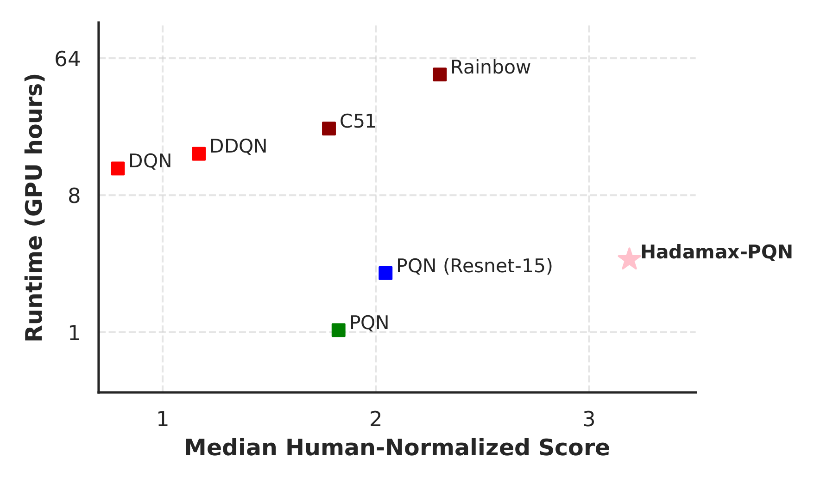
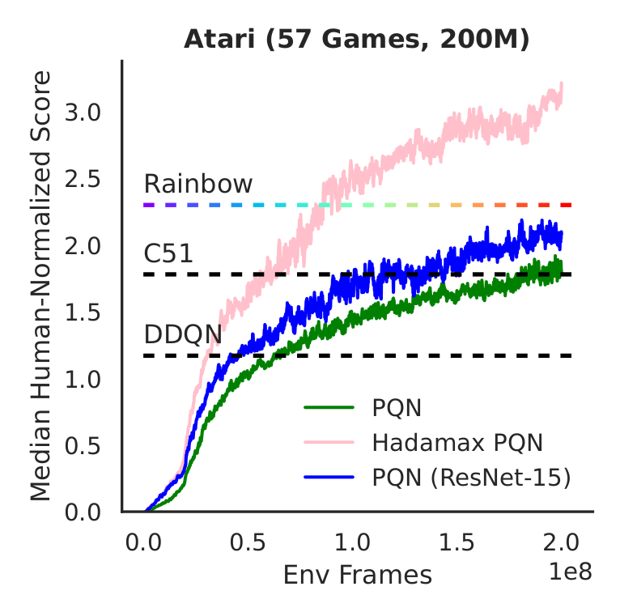

# Hadamax Encoding: Elevating Model-Free Performance in Atari

[](https://arxiv.org/abs/2407.04811)

This is the official repository for the paper: Hadamax Encoding: Elevating Model-Free Performance in Atari. The Hadamax (**Hada**mard **max**-pooling) encoder is a new pixel-based encoder that achieves state-of-the-art model-free performance on the Atari 57 200M benchmark.
### Atari Performance

After around 3 hours of training and 200M environment frames, the PQN-Hadamax variant significantly surpasses the official Rainbow-DQN benchmark from the [Rainbow Paper](https://arxiv.org/abs/1710.02298):

<table style="width: 100%; text-align: center; border-collapse: collapse;">
  <tr>
    <td style="width: 33.33%; vertical-align: top; padding: 10px;">
      <h4>Performance VS GPU-Hours 200M Env Frames</h4>
      
    </td>
    <td style="width: 33.33%; vertical-align: top; padding: 10px;">
      <h4>Training Curve 200M Env Frames</h4>
      
    </td>
  </tr>
</table>


## PQN Usage  (With Docker)

Steps:

1. Ensure you have Docker and the [NVIDIA Container Toolkit](https://docs.nvidia.com/datacenter/cloud-native/container-toolkit/latest/install-guide.html) properly installed.
2. (Optional) Set your WANDB key in the [Dockerfile](docker/Dockerfile).
3. Build with `bash docker/build_atari.sh`.
4. Run a container: `bash docker/run_atari.sh`
5. Test: `python purejaxql/pqn_atari_hadamax.py --ENCODER='hadamax' --ENV_NAME='Seaquest-v5'`.

## CleanRL's C51 Usage  (With requirements_cleanrl.txt)

1. Create a virtual environment and activate it.
2. Install the required packages: `pip install -r requirements/requirements_cleanrl.txt`.
3. Test: `python cleanrl/c51_hadamax.py --encoder='hadamax' --env_id='NameThisGameNoFrameskip-v4'`.

#### Commands:

```bash
# Train PQN in Atari with the Hadamax Encoder (Hadamax-PQN)
python purejaxql/pqn_atari_hadamax.py --ENCODER='hadamax'
# Train PQN in Atari with the Baseline Encoder (PQN)
python purejaxql/pqn_atari_hadamax.py --ENCODER='baseline'
# Train PQN in Atari with the Impala ResNet-15 Encoder (PQN ResNet-15)
python purejaxql/pqn_atari_hadamax.py --ENCODER='impala'
# Train cleanRL's Categorical DQN (C51) algorithm with a Hadamax-encoder
python cleanrl/c51_hadamax.py --encoder='hadamax' --env_id='NameThisGameNoFrameskip-v4'
```

## Citation

If you use Hadamax Encoding in your work, please cite the following paper:

-- Arxiv Submission Processsing. Will update soon.

[//]: # (```)

[//]: # (@misc{kooi2025hadamax,)

[//]: # (      title={Hadamax Encoding: Elevating Model-Free Performance in Atari}, )

[//]: # (      author={Jacob E. Kooi and Zhao Yang and Vincent François-Lavet},)

[//]: # (      year={2025},)

[//]: # (      eprint={-----},)

[//]: # (      archivePrefix={arXiv},)

[//]: # (      primaryClass={cs.LG},)

[//]: # (      url={------}, )

[//]: # (})

[//]: # (```)

## Related Projects

Our code is derived from the following repositories:

- [PureJaxRL](https://github.com/luchris429/purejaxrl)
- [PurejaxQL](https://github.com/mttga/purejaxql)
- [CleanRL](https://github.com/vwxyzjn/cleanrl)